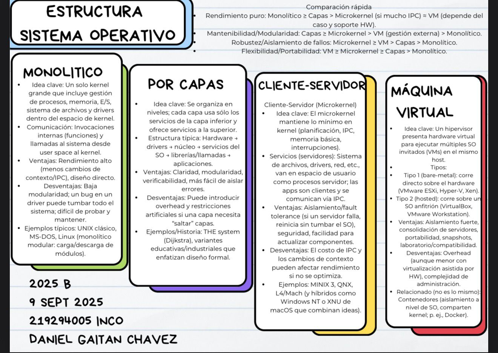

# Technical Enablement Content

Visual engineering content focused on Computer Science, Operating Systems, System Design, Networking, and Software Engineering.

Created by **Daniel Gaitan Chavez** — Computer Engineering Student at Universidad de Guadalajara (CUCEI).

---

# About This Repository

This repository showcases technical educational material, engineering visualizations, and multimedia explainers designed to simplify complex computing concepts through structured communication and visual storytelling.

The goal is not only to understand systems deeply, but also to communicate them clearly to different audiences through diagrams, presentations, infographics, and technical videos.

---

# Operating Systems Visualizations

## Operating Systems Through Computer Generations

---

## Operating Systems Timeline

---

## Threads, Processes & Multithreading

---

## Operating System Architectures

---

# Technical Video Explainers

## Enterprise Infrastructure & Cybersecurity

### Kerberoasting Attack Analysis
- Active Directory security
- Kerberos protocol
- SPN exploitation
- Offline credential attacks

<video src="videos/KereberoastingAttack.mp4" width="700" controls></video>

---

### Man-in-the-Middle (MITM) Attack Vectors
- ARP poisoning
- Packet interception
- TLS/HTTPS mitigation
- Network security fundamentals

<video src="videos/Man in the middle.mp4" width="700" controls></video>

---

### Data Center Security & Infrastructure
- Physical and logical security
- Redundancy systems
- HVAC and energy management
- Disaster recovery concepts

<video src="videos/Data Center Manual seguridad.mp4" width="700" controls></video>

---

# Software Engineering & System Design

## UML, Interaction & Architecture Modeling

### Defining Actors & System Boundaries
<video src="videos/DefiningActors.mp4" width="700" controls></video>

---

### Comprehensive UML Diagram Mapping
<video src="videos/TodoslosDiagramas.mp4" width="700" controls></video>

---

### Activity & State Diagram Modeling
<video src="videos/ActivityAndStateDiagram.mp4" width="700" controls></video>

---

### Interaction & Sequence Design
<video src="videos/DiseñoInteraccion.mp4" width="700" controls></video>

---

### Structural Design Patterns
<video src="videos/DiseñoEstructural.mp4" width="700" controls></video>

---

### Relational Database Modeling
<video src="videos/ModeloRelacional.mp4" width="700" controls></video>

---

### GUI Interface & Human-Computer Interaction
<video src="videos/GUI interface.mp4" width="700" controls></video>

---

# Tools & Technologies

- Canva
- Visual Studio Code
- AI-assisted scripting and voice generation
- UML modeling
- Database modeling
- Multimedia editing tools
- Git & GitHub

---

# Author

**Daniel Gaitan Chavez**  
Computer Engineering Student — Universidad de Guadalajara (CUCEI)

Areas of Interest:
- Software Engineering
- Systems & Infrastructure
- Technical Communication
- Competitive Programming
- AI-assisted Educational Content