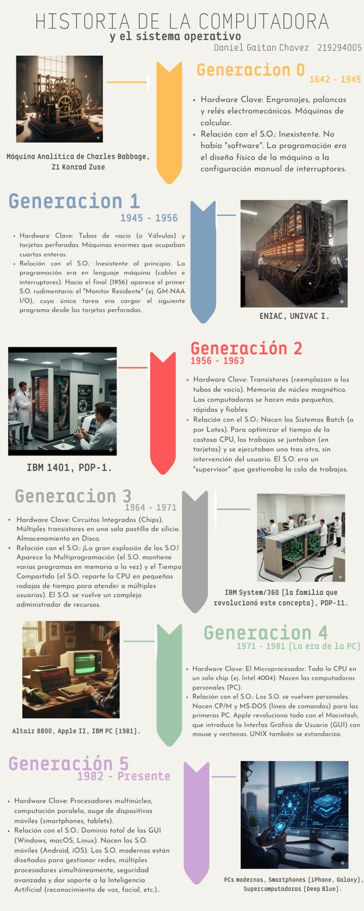
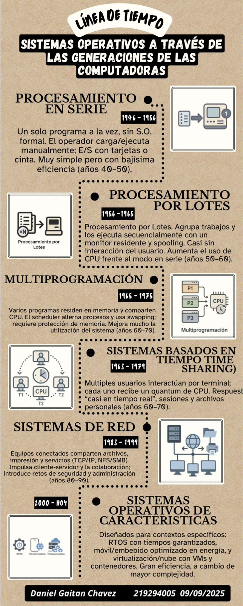
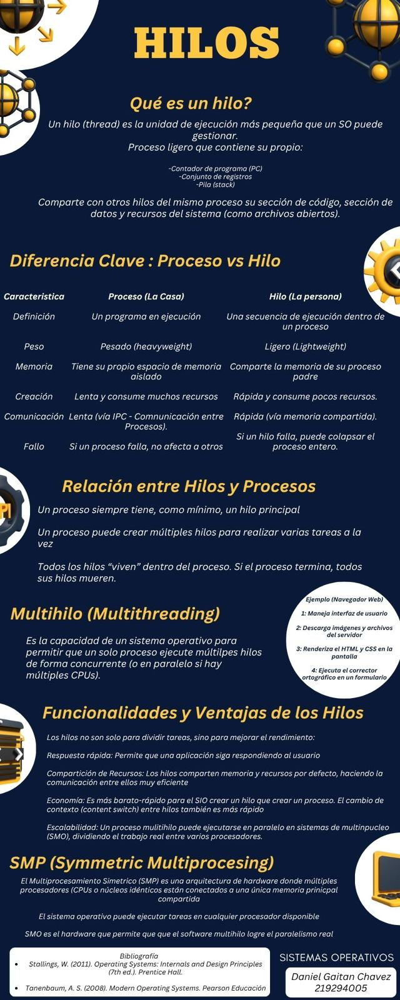

# Technical Enablement Content

Technical communication portfolio focused on Computer Science, Systems, Infrastructure, Cybersecurity, and Software Engineering concepts through visual storytelling and multimedia explainers.

Created by **Daniel Gaitan Chavez** — Computer Engineering Student at Universidad de Guadalajara (CUCEI).

---

# About This Repository

This repository showcases technical educational material, engineering visualizations, and multimedia explainers designed to simplify complex computing concepts through structured communication and visual storytelling.

The goal is not only to understand systems deeply, but also to communicate them clearly to different audiences through diagrams, presentations, infographics, and technical videos.

---

# Operating Systems Visualizations

## Operating Systems Through Computer Generations

---

## Operating Systems Timeline

---

## Threads, Processes & Multithreading

---

# Featured Technical Video Explainers

## Data Center Security & Infrastructure

Topics:
- Security by Design
- Data center physical and logical security
- Redundancy systems and Availability Zones (AZ)
- Disaster recovery and operational continuity
- HVAC, UPS and environmental management
- SOC monitoring and security governance
- NIST 800-88 media sanitization
- Enterprise infrastructure resilience concepts

Based on:
- AWS data center operational models
- ISO 27001 concepts
- Enterprise security and compliance practices

---

## Barber OS — Relational Database Modeling

Topics:
- Relational database design
- Entity relationships
- Database normalization concepts
- Software engineering documentation
- Backend-oriented system organization

Language:
- English technical presentation

---

## Barber OS — GUI Interface & User Experience

Topics:
- GUI interface walkthrough
- Human-computer interaction concepts
- User experience visualization
- Software prototype presentation
- Frontend interaction concepts

Language:
- English technical presentation

---

## Kerberoasting Attack Analysis

Topics:
- Active Directory environments
- Kerberos authentication
- SPN enumeration
- Credential extraction attacks
- Enterprise authentication security

Environment:
- Kali Linux
- Windows 10
- Windows Server
- Active Directory

Tools:
- PowerShell
- Mimikatz
- Kerberos ticket extraction techniques

---

## Man-in-the-Middle (MITM) Network Attack

Topics:
- ARP poisoning
- Packet interception
- Network traffic analysis
- HTTP vs HTTPS security
- Credential exposure in plaintext traffic

Tools:
- Wireshark

Demonstration:
- Network packet inspection and traffic visualization
- Analysis of unsecured communications over HTTP
- Security implications of missing encryption layers

---

# Additional Technical Content

Additional multimedia explainers, software engineering walkthroughs, cybersecurity demonstrations, and educational engineering material are available in the `/Videos` directory.

For the best viewing experience, featured videos are linked through YouTube previews above.

---

# Tools & Technologies

- Canva
- Visual Studio Code
- AI-assisted scripting and voice generation
- UML modeling
- Database modeling
- Multimedia editing tools
- Git & GitHub
- Linux & Virtualization Environments
- Wireshark
- Active Directory
- Windows Server
- Kali Linux

---

# Skills

- Technical Communication
- Systems Thinking
- Visual Storytelling
- Cybersecurity Concepts
- Infrastructure Fundamentals
- Educational Content Design
- AI-assisted Multimedia Production
- Software Engineering Documentation
- Enterprise Technology Concepts

---

# Author

**Daniel Gaitan Chavez**  
Computer Engineering Student — Universidad de Guadalajara (CUCEI)

Areas of Interest:
- Software Engineering
- Systems & Infrastructure
- Technical Communication
- Competitive Programming
- AI-assisted Educational Content
- Enterprise Technology
- Cybersecurity & Networking
- Cloud & Data Center Infrastructure